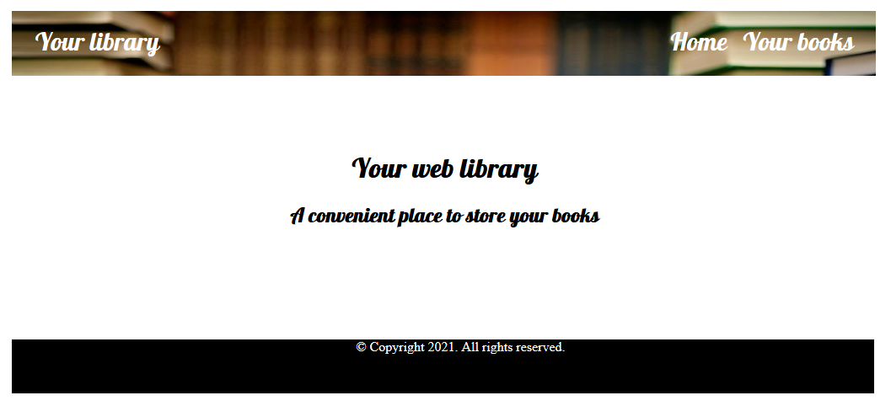
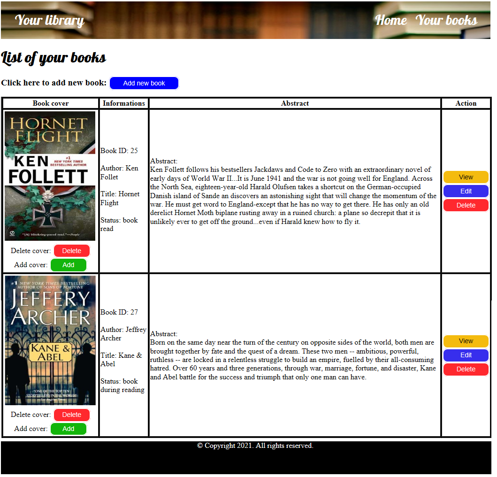
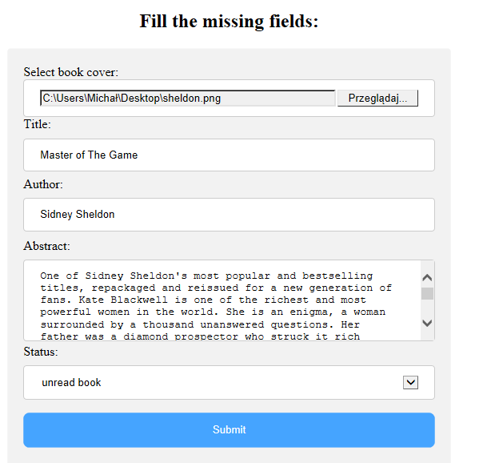
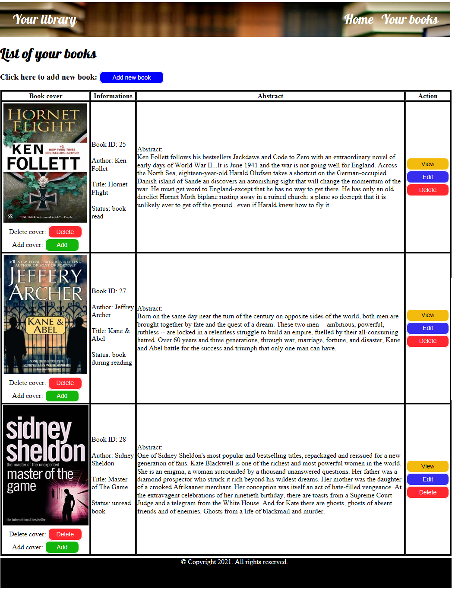

# MyLibraryWebApp

This is one of my next Java web projects. 
This application is a web library where you can store books. The project provides CRUD operations.
It allows you to add new books with covers, edit informations about them, change their covers or remove selected books from library.
This project has only one commit, when I uploaded it to the repository, because I did not know GIT when I started programming this app.  
I also wrote some unit tests using JUnit.   
I used Eclipse IDE to create this application.

## Used technologies
- Maven,
- Bootstrap,
- JSTL,
- JUnit,
- Hibernate,
- MySQL database.
- Apache Common IO,
- Apache Commons FileUpload.

# How it works ?

After launching the application in your browser, a home page will appear at the corresponding address.

After pressing the "Your books" link on the navigation bar, a table of your books will appear.

Press the "Add new book" button to add a new book. 
This will redirect you to add book form, which you need to fill.  
You will need to fill fields with informations about book. You can add book cover now or later.

Press "Submit" button to add book. It will redirect you to the page with books table.

You can also edit and delete selected book by clicking the appropriate button.  
You can delete and add new book cover by clicking the buttons under the book cover.  
Remember to delete book cover before adding a new one :).

Here it is possible to view a particular book by clicking on the "View" button.
This will display the selected book and show informations about it.

You can turn back to home page or books table by clicking the appropriate link in the navigation bar.

I think it is a very nice project and I am considering extending this project in the future.

# Author

Michal Wonia  
Poland
